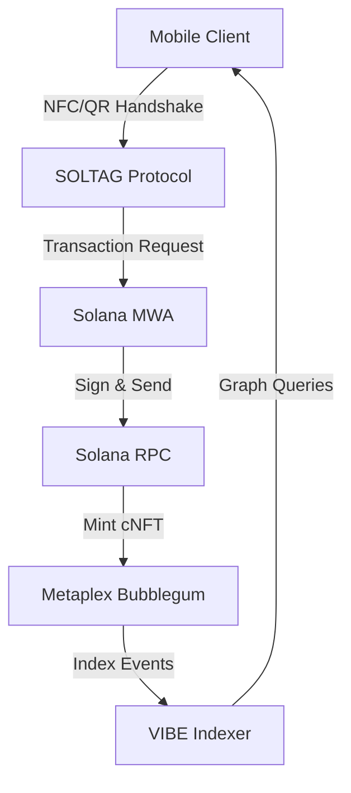

# VIBE | Global Social Infrastructure
### Powered by the SOLTAG Protocol

[](https://solana.com)
[](https://vibe.social)
[]()

VIBE is a decentralized human connection network that transforms physical interactions into verifiable on-chain assets. By leveraging the **Solana Mobile Stack** and the **SOLTAG Protocol**, VIBE creates an immutable real-world social graph, providing the trust layer for the next generation of decentralized identity (DeID).

---

## 💎 The Vision
In a world increasingly dominated by synthetic identity and bot-driven interactions, VIBE re-anchors social value in physical presence. Every "VIBE" is a cryptographic proof-of-connection (PoC), minted as an ultra-low-cost compressed NFT (cNFT).

Our mission is to build the foundational infrastructure for **Proof-of-Presence**, enabling developers to build reputation systems, local commerce, and governance models on top of a verified human network.

---

## 🚀 Technical Core
VIBE is engineered for global scale and production-grade reliability:

- **Mobile First**: Native React Native implementation optimized for the **Solana Saga** and and modern mobile hardware.
- **Bi-Modal Handshake**: Ultra-fast **NFC Tap** for the "magic moment" with **Vision-powered QR** fallback.
- **High-Throughput Minting**: Utilizes **Metaplex Bubblegum** to achieve near-zero transaction costs ($0.000002/mint), allowing the protocol to handle millions of connections.
- **Resilient Infrastructure**: 
  - **Offline-First**: Proprietary synchronization queue ensures 100% data integrity even in zero-connectivity environments.
  - **Spatial Intelligence**: GPS-validated metadata anchors every connection to a physical coordinate.
  - **Graph Native**: Built-in BFS (Breadth-First Search) traversal for real-time degree-of-separation discovery.

---

## 📂 Architecture Overview



### Key Modules
- **`mobile/`**: The frontend flagship app.
- **`blockchain/`**: The Umi-powered link to Solana Devnet/Mainnet.
- **`server/`**: Scalable API layer for social graph traversals.
- **`indexer/`**: High-performance worker for blockchain event ingestion.

---

## ⚡ Setup & Execution

### Prerequisites
- Node.js 18+
- Solana Mobile SDK
- Android/iOS Emulator

### Deployment
```bash
# Clone and Install
git clone https://github.com/nayrbryanGaming/vibe.git
cd vibe/mobile
npm install --legacy-peer-deps

# Execution
npm run start
npm run android # Or npm run ios
```

For comprehensive configuration, see [Docs/Setup](docs/setup.md).

---

## 📊 Deployment Roadmap
- **Phase 1**: Core Handshake (NFC/QR) & cNFT Proof-of-Connection. **(COMPLETED)**
- **Phase 2**: Global Social Graph API & Heatmap Visualization. **(COMPLETED)**
- **Phase 3**: Passive Peer Discovery (BLE - Bluetooth Low Energy).
- **Phase 4**: Mainnet Expansion & Institutional SDK.

---

## 🛡 Security & Compliance
- **Cryptographic Signatures**: All handshakes require double-sided wallet authorization.
- **Replay Protection**: Nonce-based connection verification.
- **Privacy-First**: No PII stored on-chain; connections are purely wallet-to-wallet.

---

## 🤝 Community
VIBE is open-source and community-driven. Built for the **Solana Monolith Hackathon**.

*Building the future of human connection, one VIBE at a time.*
